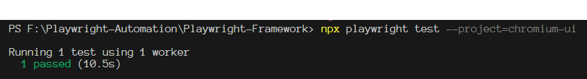
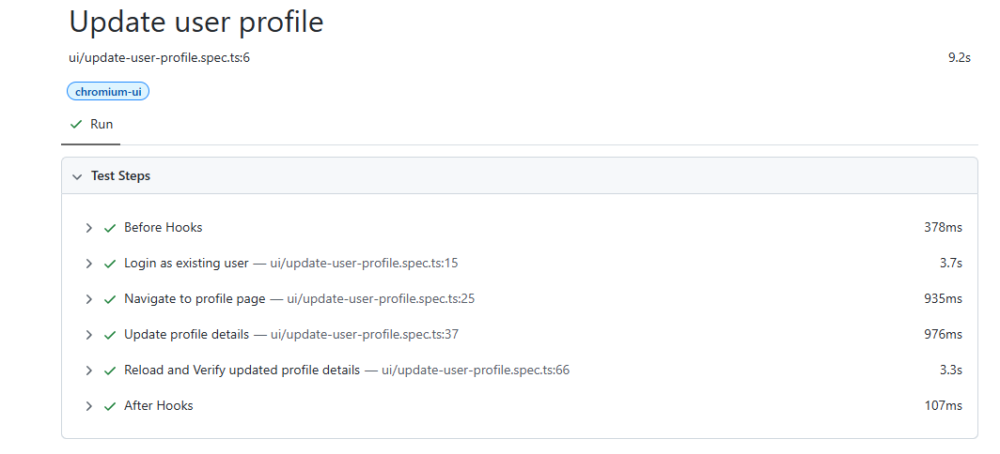

# 🎭 Playwright UI Automation - Buggy Cars Rating

Automation Framework written using [Playwright](https://playwright.dev/) - Typescript to validate the [Buggy Cars Rating](https://buggy.justtestit.org/) web application.

---

## ✨ Features

- Login and profile update flow
- Randomized test data using utilities
- Multi-browser testing (Chromium, Firefox, WebKit)
- Page Object Model structure
- JSON based test data
- Environment-based config using .env
- CI integration ready (GitHub Actions)


---
## Pre-requisites (IMPORTANT!!)
Make sure NodeJS and GIT is installed in your machine. If not,
You may install and download it here:
 - [Git](https://git-scm.com/downloads/win)
 - [NodeJs](https://nodejs.org/en)

## 🚀 Getting Started
### Open CMD / VSCode

### 1. Clone the Repository
Make sure to change directory (cd) using the correct repo name below. Same letter casing 
```bash
git clone https://github.com/smplpz21/Playwright-Framework.git
cd Playwright-Framework
```
### 2. Install Dependencies
```bash
npm install
```
### 2. Install Playwright Browsers
```bash
npx playwright install
```
### 3. Running tests
Run all tests
```bash
npx playwright test
```
Run a specific test file
```bash
Run a specific test file with specific browser
```
```bash
npx playwright test tests/ui/update-user-profile.spec.ts --project=chromium-ui
```
```bash
npx playwright test tests/ui/update-user-profile.spec.ts --project=firefox-ui
```
```bash
npx playwright test tests/ui/update-user-profile.spec.ts --project=webkit-ui
```
Run all test with specific browser
```bash
npx playwright test --project=chromium-ui
```
```bash
npx playwright test --project=firefox-ui
```
```bash
npx playwright test --project=webkit-ui
```
Sample run: 



### 4. HTML Report
After running the test, execute command below to load report:
```bash
npx playwright show-report
```


## 📌 Notes
	•	Do not commit .env files with real credentials.
	•	Test data can be managed in test-data/ui/*.json.

## Author
Sam Lopez - Test Automation Analyst
```bash
If you have any questions and comments regarding the framework feel free to reach out! Happy coding :)
```
